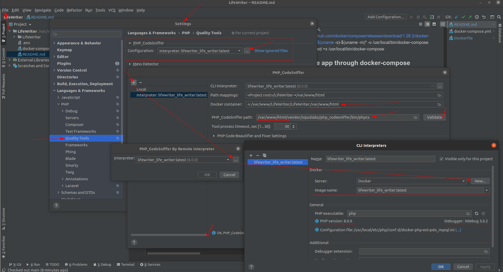
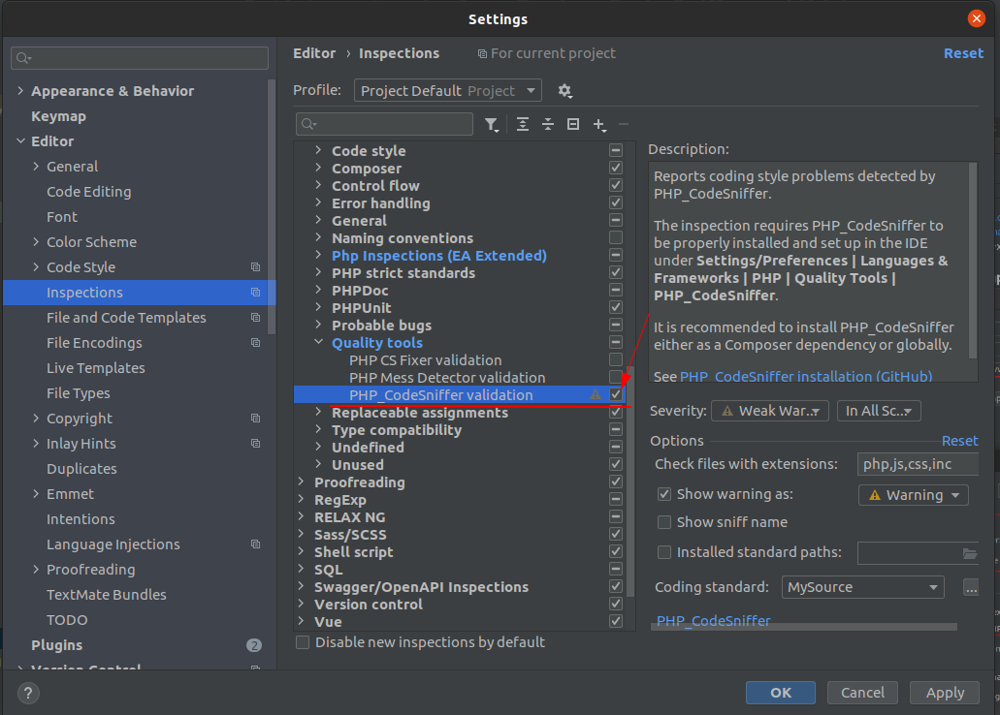
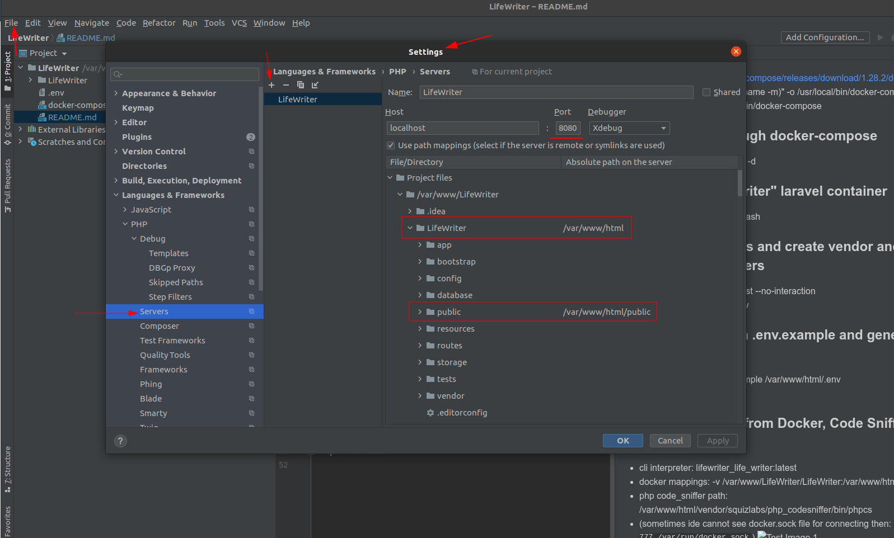
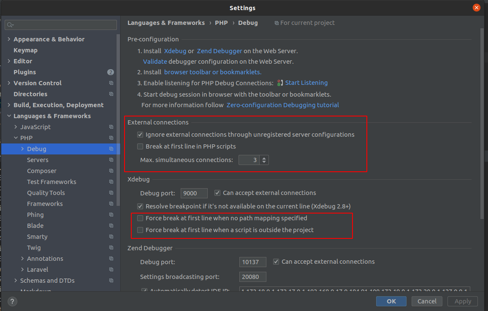

# **Install App**

### Install git.
- sudo apt install git

### Clone LifeWriter app from github.
- https://github.com/oohegor/LifeWriter.git

### Install docker.
- sudo apt install apt-transport-https ca-certificates curl software-properties-common
- curl -fsSL https://download.docker.com/linux/ubuntu/gpg | sudo apt-key add -
- sudo add-apt-repository "deb [arch=amd64] https://download.docker.com/linux/ubuntu focal stable"
- sudo apt update
- apt-cache policy docker-ce
- sudo apt install docker-ce
- sudo systemctl status docker
- sudo usermod -aG docker ${USER}
- su - ${USER}
- id -nG

### Install docker-compose.
- sudo curl -L "https://github.com/docker/compose/releases/download/1.28.2/docker-compose-$(uname -s)-$(uname -m)" -o /usr/local/bin/docker-compose
- sudo chmod +x /usr/local/bin/docker-compose

### Install the app through docker-compose.
- docker-compose up --build -d

### Enter inside "life_writer" laravel container.
- docker exec -it life_writer bash

### Install dependencies, create 'vendor' and 'node_modules' folders and generate complete '.env' file.
- deploy.sh

### Run app.
- npm run dev

### Set interpreter PHP from Docker, Code Sniffer and Xdebug.
- *cli interpreter:* **lifewriter_life_writer:latest**
- *docker mappings:* **-v /var/www/LifeWriter/LifeWriter:/var/www/html**
- *php code_sniffer path:* **/var/www/html/vendor/bin/phpcs**
- *path to phpcbf:* **/var/www/html/vendor/bin/phpcbf**
- (sometimes ide cannot see docker.sock file for connecting then: `sudo chmod 777 /var/run/docker.sock`)
- 
- 
- create Server for xdebug PHP -> Servers and set paths /var/www/LifeWriter/LifeWriter = /var/www/html, also for /public directory
- 
- (if you don't want to use listening Php Debug Connection for code sniffer, just set this options)
- 

### Additional work commands.
- docker-compose images
- docker-compose ps
- docker-compose down
- docker rmi
- npm run dev
- npm run watch
- etc...
